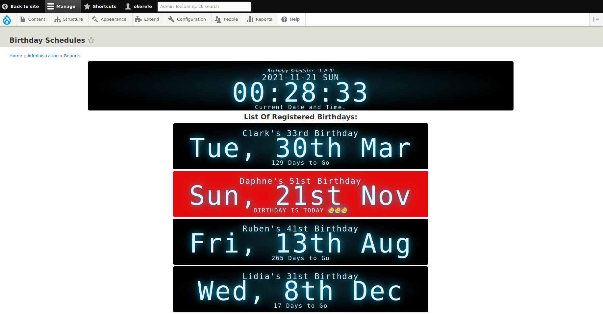

# Birthday Scheduler Drupal Module

## Drupal Module Development Technical Test.
	


### About Birthday Scheduler
Birthday Scheduler is a Drupal Module that Has the Primary Function of Saving User's Birthdays that they submit through a Form Powered by the Plugin and then displaying the Birthdays on a report page that can be accessed by the admin. this report page displays all the submitted birthdays and then tells how many days are left to that day. It also notifies in a special way, if any of the Scheduled Birthdays is the current Day.
This report page also displays the current date and time.

### Installation and Use.
For the sake of this Project, the Drupal Module (Birthday Scheduler) comes along with the entire Drupal Installation. so to test it, you have to clone this git repo which contains the entire Drupal installation.
after cloning the repo, you go ahead and set it up the way the Drupal installation should work, by Installing the composer dependencies, populating the settings.php file, the database, and all other needed files.
steps for this can be found in some great resources online.

After booting up the entire Drupal website, you can then activate the Module from amongst the list of Modules.
The Module Uses a Custom Block that contains the Birthday Form and that can be placed anywhere in your website layout.
You then have to activate and display this block.

Go to Structure>>Block Layout and choose a position among the list of block positions based on your current activated theme.
when you get to your preferred position, click place block. a popup comes up showing the list of other custom blocks. Search for Birthday Scheduler and then click place Block.
after doing this, the block which contains the Birthday Scheduler Birthday form will be displayed in the position you specified.

### Usage
The block by default is available to every user so far they can access the page where it is placed.
so when a user fills the form on the block the birthday date is saved to the database.

Any user with admin privileges can access the list of Scheduled birthdays by visiting the /admin/reports/birthday_scheduler URL of the Drupal installation.  this is also available in the menu under Report>>List Of Scheduled Birthdays

## Development Practices.
The Module was built with the best Drupal Module Development Practices. It was properly unit tested using solid and best TDD practices.
The code style was also checked to strictly follow the Drupal/Coder Coding standard. enforced by PHP Code Sniffer.
The front end which displays the list of users' birthdays is powered by the Vue.js framework. It was also built with best practices alongside Unit Tests for the Vue Components.

### Running the Unit Tests.
The entire project is powered by the root composer installation that powers the entire drupal installation. so the module is also part of that project and is not a composer project of its own.
To run the PHP unit tests, cd into the root of the entire Drupal Project.
cd TT
and then run the code as follows.
```bash
$ php -d auto_prepend_file=docroot/modules/custom/birthday_scheduler/tests/bootstrap.php bin/phpunit -c docroot/core/phpunit.xml.dist docroot/modules/custom/birthday_scheduler/tests/src
```
Ya. quite long right, Our Tests uses a PHP Library called [`Brain Monkey`](https://giuseppe-mazzapica.gitbook.io/brain-monkey/)   that helps in mocking global function calls thus making the whole mocking and test process what it should ideally be like.
but Brain monkey uses another great library called [`Patchwork`](https://patchwork2.org/) and the way patchwork works, it has to be loaded first before any other dependencies or global functions are loaded and declared. and this is quite tricky in the Drupal installation as it always shows an error that functions can't be properly mocked cause Drupal has already been loaded and has defined those functions.
So what we are doing in the above code is we are first auto pretending a file:
```bash
 auto_prepend_file=docroot/modules/custom/birthday_scheduler/tests/bootstrap.php
 ```
this file requires patchwork from the vendor directory and hence loads it before running
```bash
bin/phpunit
```
followed by that is the path to the phpunit.xml file. here we are using the root Drupal installation's config XML file.:
```bash
-c docroot/core/phpunit.xml.dist
```
then followed is the path where our desired tests that we want to run are located.
```bash
docroot/modules/custom/birthday_scheduler/tests/src
```

### Running Unit tests for JS.
for the sake of usage, the JS files have all been compiled. but If further updates need to be made or new features are added to the Vue Components. one has to install the Javascript Node dependencies. unlike the composer project which is site-wide, the Js project is restricted to just the module.
so cd into the module.
```bash
$ cd docroot/modules/custom/birthday_scheduler
```
and with  npm installed, download the npm dependencies by running 
```bash 
$ npm install 
``` 
command after then you can run the tests by hitting the command
```bash 
$ npm run test
``` 
 ### Possible Feature addition and upgrade.
 - The workspace synchronization will sync all your files, folders, and settings automatically. This will allow you to fetch your workspace on any other device.

 - This app could be further worked on so to add more features and upgrade existing ones. Ideas on how this could be done include:
 - Proper Integration tests could be built for the backend of the Module.
 - Emails could be scheduled to be sent to celebrants on their birthday.
 - Birthday Form could include file upload for the user's profile photo.
 - Another block could be created and placed in a public place on the site. and it could display any user or user's birthday is the current day.

 - and of course much more.

please feel free to add Ideas, make corrections, and do any other thing that could improve the project entirely.
##### ```Gracias....```

